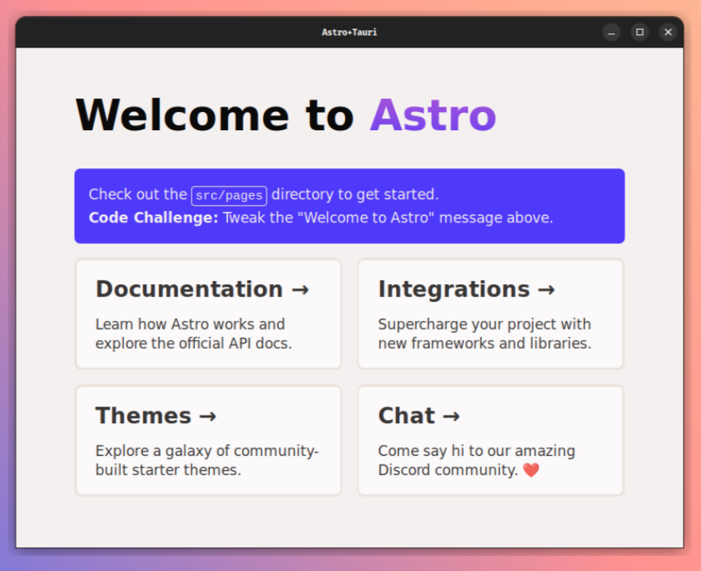

# NxAstroTauri

WIP starter for desktop app building with [Astro](https://astro.build/)+[Tauri](https://tauri.app/fr/) in [NX](https://nx.dev/) monorepo

---

## Prerequisites

- Use a node version manager ([nvm](https://github.com/nvm-sh/nvm))
- Tauri https://tauri.app/v1/guides/getting-started/prerequisites/

## How to dev

### Web

- npx nx run web-my-app:dev

### Desktop

- npx nx run src_tauri:dev
